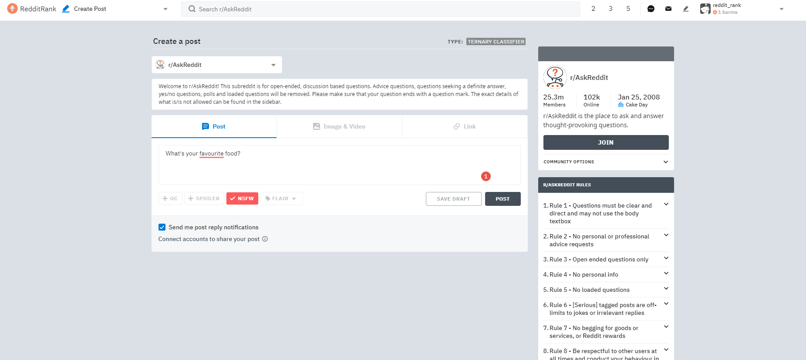
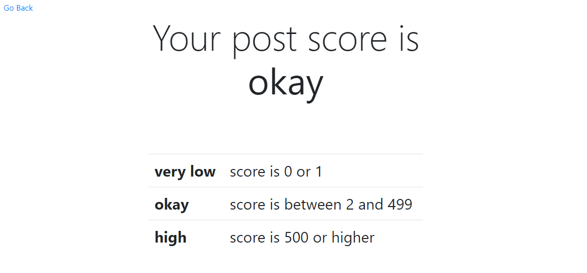
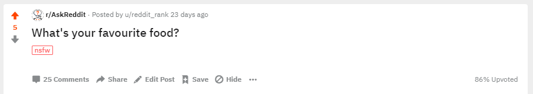

   

 

### Table of Contents

* [What is RedditRank?](#whatis "Find out what RedditRank is")
    * [About RedditRank](#about-rr "Jump to About RedditRank")
    * [What's the point?](#why "Jump to What's the Point?")
    * [Sample Demonstration](#sample-demo "Jump to the sample demonstration")
* [Project Tasks](#tasks "Jump to Project Tasks")
    * [Project Proposal Report](#proposal_report "Jump to Project Proposal")
    * [Project Proposal Presentation](#proposal_presentation "Jump to Project Proposal Presentation")
    * [Progress Report](#progress_report "Jump to Progress Report")
    * [Final Presentation](#final_presentation "Jump to Final Presentation")
    * [Final Report](#final_report "Jump to Final Report")

 

## What is RedditRank?

### About RedditRank

RedditRank is a Machine Learning project that uses neural networks to classify posts on <a href='https://reddit.com/r/askreddit' target='_blank'>/r/AskReddit</a> into score categories based on the content and its context. We particularly focus on binary, ternarny and quinary classifiers for these posts. 

### What's the point?

Neural networks are well-suited to this task given their popularity and success in natural language processing, the availability of data and data collection methods (scraping APIs), and the intrinsic labelling in posts (score). The classifier would provide a means for estimating post/advertisement popularity without requiring users to publish content. Used as an early testing method, our classifiers could then help industry and users alike with improving their advertising or post quality.

### Sample Demonstration

A website was created to allow users to test the model in a user-friendly manner. The design of the webpage was chosen to very closely match the interface that is given when actually creating a post on the subreddit. In this page, the user is able to input the title of their post, and select whether or not the post is NSFW (mature content). When the user submits to see their result, additional context such as the time and weekday is passed in as well as the existance of a [Serious] tag in the title of the post.

</img>

Within this sample input, we input the title as "What's your favourite food?" and toggle the NSFW tag on. This is a relatively silly post that you would generally not find on the subreddit, as there is no clear reason as to why the title of the post may imply mature content. Despite this, our ternary classifier gives the following result after the 'POST' button is clicked.

</img>

The ternary classifier determines that with the given context, the post will have a final score between 2 and 499. With the confusing context of the post, the original hypothesis was that the post was going to have a score of 0. We then post the exact same context onto the actual subreddit, and wait to see the results.

</img>

For this particular example, we find that the score of the post is 5 (after many days of no activity on the post), falling within the predicted category.

 

## Project Tasks

### Project Proposal Report
[View Project Proposal Report](ProjectProposal/RedditRank-ProposalReport.pdf "View Project Proposal Report")

The Project Proposal Report is a document that outlines:
* What the goal of the project is and why is it of interest
* How data will be obtained for training and testing usage
* Overall structure and architecture of the model
* Plan and deadlines for task management
* Potential risks of the project
* Ethical issues regarding the project

 

### Project Proposal Presentation
[View Project Proposal Presentation](ProjectProposal/RedditRank-ProposalPresentation.pptx "View Project Proposal Presentation")

The Project Proposal Presentation is the visual aid to a presentation that quickly summarized the contents of the Project Proposal Report. It gives a brief explanation of:
* The main idea of the project
* Data collection, processing and labelling methods
* Architecture for the baselines and actual model
* Risks of the project
* Planned objectives before Progress Report

### Project Progress Report
[View Project Progress Report](ProgressReport/RedditRank-ProgressReport.pdf "View Project Progress Report")

The Project Progress Report is to ensure that we are on track to complete the project as planned. It shows that we have made good progress on:
* Collecting almost all the data
* Producing a baseline model
* Producing at least one result, including one qualitative or quantitative comparison
* Reflecting upon the feedback given at proposal time

### Final Presentation
[View Final Presentation](FinalPresentation/RedditRank-FinalPresentation.pptx "View Final Presentation")

The Final Presentation is the visual aid to a presentation that gave a complete overview of the project. It touches on the following components:
* Introduction and Motivation
* Data and Data Processing
* Model and Architecture
* Quantitative and Qualitative Results
* Discussions and Learnings

### Final Report
[View Final Report](FinalReport/RedditRank-FinalReport.pdf "View Final Report")

The Final Report is a complete summary of the work done in the project. It describes what we have accomplished and why, what results we have obtained as well as an interpretation of those results, and an ethical analysis. The full set of points that were covered are:
* Goal and Motivation of Project
* Background and Related Works
* Data Collection, Cleaning and Statistics
* Final Neural Network Model Architecture
* Baseline Model Comparison
* Quantitative and Qualitative Results
* Discussion, Interpretation and Learnings of Results
* Ethical Analysis and Framework
* Project Difficulty and Quality